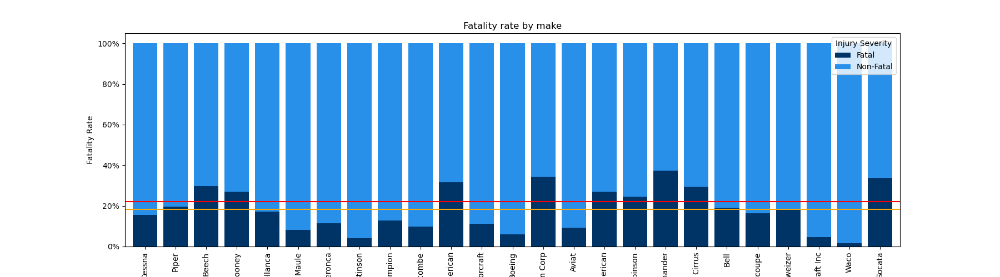
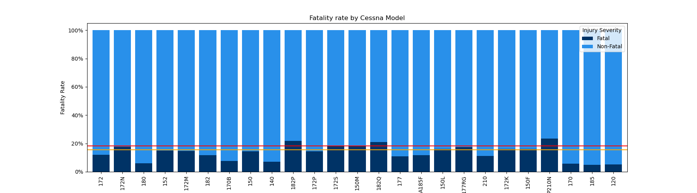
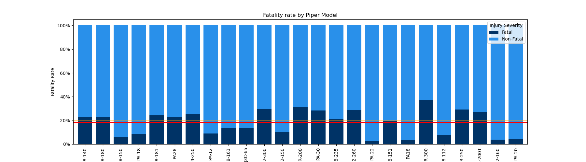
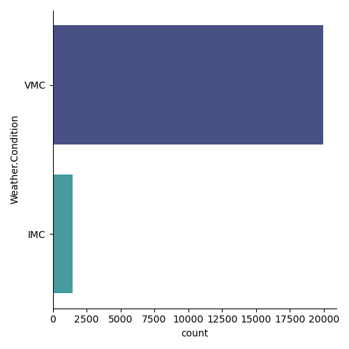
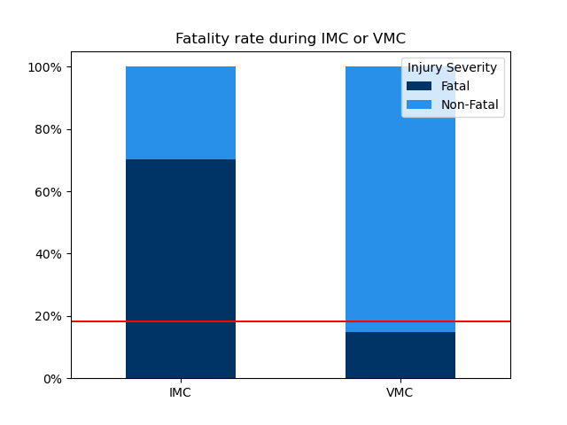
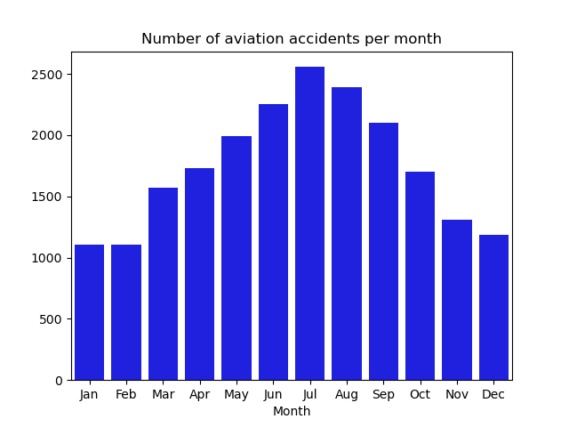
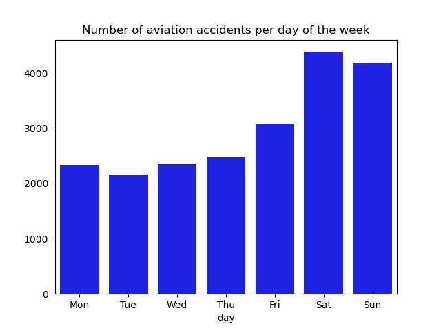

# Airline Aviation Accident Analysis

**Authors**: Franko Ndou, Lucas Kimball

## Overview

The purpose of this project is to conduct an Exploratory Data Analysis (EDA) on [aviation accident](https://www.kaggle.com/datasets/khsamaha/aviation-accident-database-synopses) data. Through a thorough examination of the dataset, our aim is to offer customized recommendations to companies based on their safety requirements. Furthermore, our analysis will provide valuable insights for companies in effectively managing and operating an airline, thus minimizing unwarranted risks to both employees and passengers.

[Tableau Interactive Dashboard](https://public.tableau.com/shared/3FGQK2CJW?:display_count=n&:origin=viz_share_link)

## Business Problem


The startup company **"Landmark Airlines"** is embarking on creating a flight experience company. These companies provide short flights or aerial experiences to individuals who are interested in enjoying the sensation of flying or exploring their local area from the sky. The company is currently focused on acquiring and operating airplanes for both commercial and private use. However, Landmark Airlines lacks sufficient knowledge regarding the potential risks associated with aircraft operations. It is our responsibility to assess and identify the aircraft options with the lowest risks, providing actionable insights for the head of the new aviation division. These insights will play a pivotal role in guiding the company's decisions regarding which aircraft to invest in for this promising new business venture.

***
Questions to consider:
* What is the total fatality rate and using it to Analyze fatality rates based on makes and models?
* What is the fatality rate of VMC and IMC flights compared to the average flight fatality rate?
* What is the number of accidents per month and per day of the week since 1995?
***

## Data

We are using a filtered and cleaned data set of [aviation accident data](https://www.kaggle.com/datasets/khsamaha/aviation-accident-database-synopses). Initially it contained accident data from countries outside of the United States as well as accident data well before the 90s. We decided to filter the data from 1995-Present because the average aircraft is in service for 30 years. Were working with a set with the shape of (22400, 24). Some of the more important cateogories within the set are the weather conditions of each accident, aircraft damage, makes and models of each aircraft, casuality numbers, specific dates (Months, years, day of the week), as well as the severity of injury. All of this helps us understand what occurs most often during these accidents.

## Methods

This project delves into an extensive exploratory analysis of aviation accident data to observe trends in safety. This is valuable for Landmark Airlines' business requirements, as it aids them in gaining a clearer understanding of the industry-defined norms for safety and appropriate business conduct. 


## Conclusions

### Makes and models




- Cessna models have a below average fatality rate, Piper models have an above average rate with a few expections with incredibly low rates. Landmark Airlines should invest in the following aircrafts
    - Cessna 172 
    - Cessna 180 
    - Piper PA-18-150 
    - Cessna 170B 
    - Piper PA-18 

### Weather Conditions



- IMC (Instrumental meteorological conditions) are incredibily dangerous to fly in, with an average fatality rate of 70%, and 55% of aircrafts being destroyed within those accidents. VMC flights experienced a 14% fatality rate and a 10% rate of aircraft destruction. IMC conditions warrant avoidance, given that even skilled aviators encounter substantial challenges when navigating such conditions. Empirical data unequivocally supports the assertion that venturing into IMC territory is excessively hazardous and should be categorically dismissed or, if circumstances permit, flight plans should be rescheduled.

### Air traffic data



- The months with the highest air-traffic are within the summer. Peaking in July, these are where most accidents happen, all though this is more likely becuase of the volume of flights rather then any direct correlation. The same can be said for weekend flights. It is crucial to take extra precautions to prevent accidents. Ensuring that pilots are well-trained and adequately prepared to handle the increased activity is essential. Additionally, thoughtful scheduling of flights should be prioritized to minimize congestion in the airspace.


### Next Steps
 
Further analyses could yield additional insights to further improve operations at Landmark Airlines:

- Scenario Analysis: Conducting scenario analysis to understand how different external factors (e.g., economic downturns, regulatory changes) could impact the feasibility and safety of Landmark Airlines' operations


- Validation: If possible, validate our recommendations with experts in the aviation industry. They might provide valuable insights and feedback on the feasibility and practicality of our suggestions.

- Risk Mitigation Strategies: Based on your findings, you could recommend specific risk mitigation strategies for Landmark Airlines. These could include pilot training programs, maintenance protocols, weather-related flight scheduling, and more.

- Importing General Aviation Data: All of the data used came from accidents within the United States; to be able to fully understand and comprehend any trends, we need something to compare it to. Importing another CSV file or even scraping the web for activity data so that we could make a more detailed analysis would be beneficial to the company.

- Machine Learning Models: If we had more time and additional data, we could explore building predictive models to forecast accident likelihood based on various factors such as aircraft type, weather conditions, and flight time. This could provide a more dynamic understanding of risk factors.

## For More Information

Please review our full analysis in [our Jupyter Notebook](./code/Visualizing_Aviation_Data.ipynb) or our [presentation](./Aircraft_Safety_Presentation.pdf).

For any additional questions, please contact us:

**Franko Ndou & frankondou@gmail.com, Lucas Kimball & lucaskimball98@gmail.com**

## Repository Structure

Describe the structure of your repository and its contents, for example:

```
├── code
│   ├── __init__.py
│   ├── Cleaning_Aviation_Data.ipynb
│   └── Visualizing_Aviation_Data.ipynb
├── data
│   ├── AviationData.csv
│   ├── Piper_Cessna_Passengers_aviation.csv
│   └── cleaned_aviation.csv
├── images
├── README.md
├── .gitignore
└── Aircraft_Safety_Presentation.pdf
```